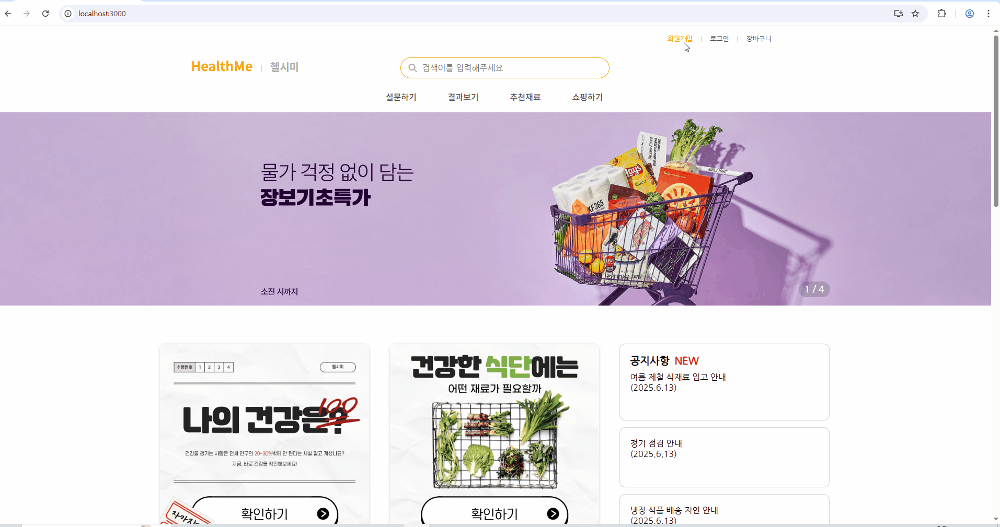
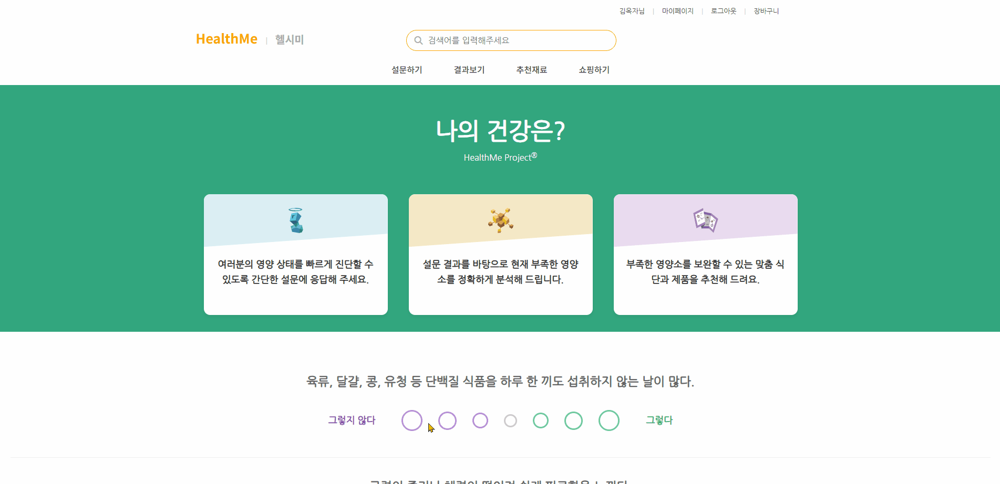
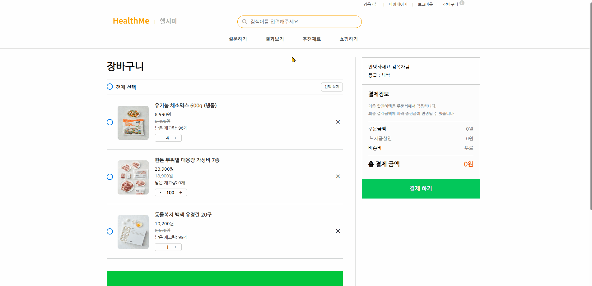
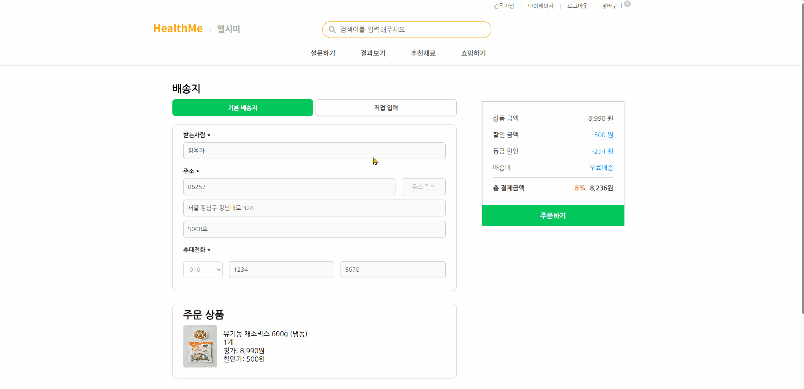
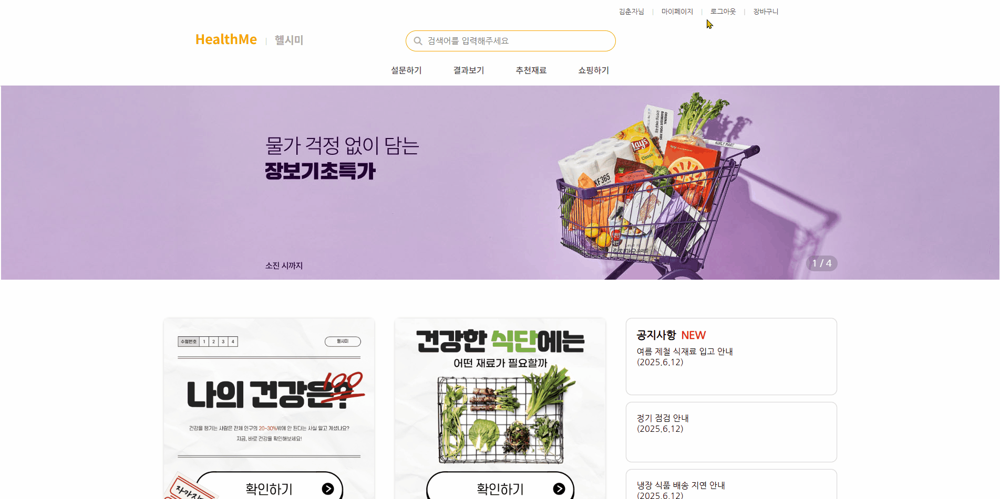
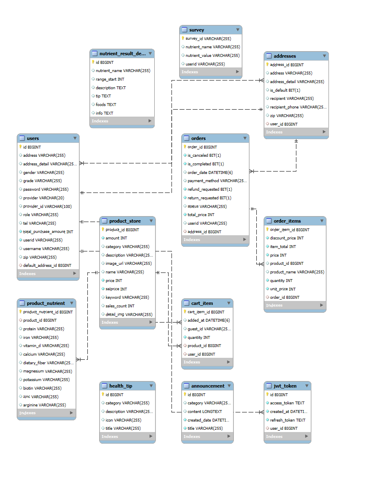
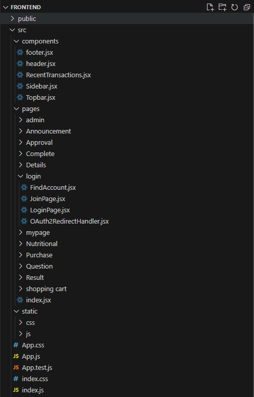
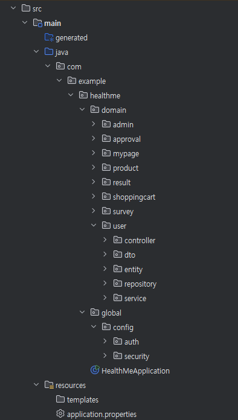

  

#### 사용자의 건강 성향을 분석해 개인 맞춤형 식품을 추천하고, 직접 장바구니에 담아 쇼핑까지 할 수 있는 영양 큐레이션 플랫폼입니다.

---

## 주요 기능

- 회원가입 / 로그인

  

 

- 설문조사 / 설문조사 결과

   
  

 

- 추천재료 / 쇼핑 / 상세

   
   
  

 

- 장바구니 / 결제

   
  

 

- 마이페이지 / 공지사항

  

 

- 관리자페이지

  

 

---

# **개발 동기**

현대 사회는 건강 관리에 대한 관심이 높지만, 많은 이들이 **자신에게 맞는 식품 선택에 어려움**을 겪습니다.
특히 다이어트나 특정 질환 관리 등 목적에 따라 필요한 영양소가 다름에도 불구하고,
기존 쇼핑몰에서는 이를 반영한 **개인화된 추천 기능이 부족**하다는 문제가 있었습니다.
이러한 문제의식에서 HealthMe는 시작되었습니다. 저희는 사용자의 간단한 설문을 통해 **영양 성향을 정확하게 분석하고,
그 결과에 가장 적합한 식품을 추천해주는 플랫폼**을 기획했습니다. 이는 정보의 홍수 속에서 **나에게 최적화된 건강 관리 솔루션**을 갈망하는 현대인의 필요를 충족시키기 위함입니다.

---

# **기획 의도**

단순히 일반적인 건강 정보를 제공하는 것을 넘어, 사용자 개개인의 고유한 특성을 반영한 **데이터 기반 개인화 추천 플랫폼**을 제공합니다.
기획 초기에는 간단한 설문형 웹 앱이었지만,
**사용자가 자신의 영양 성향을 더 잘 이해하고** 그에 맞는 식품을 손쉽게 선택할 수 있도록,
실제 식품 추천과 장바구니, 결제까지 연결되는 **풀 스택 서비스**로 발전시켰습니다. HealthMe는 당신의 건강을 위한 최적의 식생활을 설계하고, 그에 맞는 식품을 손쉽게 선택할 수 있도록 지원합니다..

---

# 레퍼런스 플랫폼

- [마켓컬리 (https://www.kurly.com)](https://www.kurly.com)

마켓컬리는 사용자 맞춤 추천, 간결한 UI, 식품 중심의 쇼핑 흐름 등에서 큰 영감을 받았습니다.  
특히, **카테고리별 탐색 / 상품 상세 구성 / 장바구니 결제 흐름** 등을 벤치마킹하여  
사용자가 불편함 없이 식품을 탐색하고 구매까지 할 수 있도록 UX를 설계하였습니다.

---

# MEMBER

| 이름   | 역할 | 담당 파트 | 맡은 내용 |
|--------|------|---------------------------|----------------------------------------------------------------------------------------------------------------------------------------------------------------------------------------------------------------------------------------------------------------------------------------------------------------------------------------------------------------|
| 전정현 | 팀장 | 메인, 추천재료, 설문조사, 재료구매, 상품 상세, 헤더, 푸터 | 메인 페이지: 동적 배너, 상품 목록 로드, 비회원 임시 ID 발급 및 권한 제한   상품 상세 페이지: 아이템 정보 표시, 실시간 결제 금액 계산, 장바구니/바로 구매 기능 (회원/비회원 장바구니 연동 - 로그인 시 비회원 장바구니 내용 유지)   설문지 페이지: 설문 문항 로드, 영양 성향 점수 부여 로직, 자동 문항 전환   추천 재료 페이지: 설문 기반 결과 그래프, 영양 성분별 그래프 동적 변경, 다양한 정렬, 장바구니 기능, 추천 상품 로드   구매 페이지: 선택 상품 정보 로드, 정렬 기능   헤더&푸터: 전체적인 구성 및 장바구니 알림 기능 |
| 하태형 | 조원 | 로그인/소셜로그인, 회원가입, 아이디/비밀번호찾기, 설문결과 | 로그인/회원가입: JWT 기반 로그인 및 회원가입 처리, 이메일·휴대폰 인증 기능 구현, 비밀번호 재설정 프로세스 설계   소셜 로그인(OAuth2): 카카오·네이버·구글 연동 로그인 기능 구현 및 사용자 정보 통합 처리   설문 결과: 사용자 설문 응답을 기반으로 영양 성향 점수를 산출하는 분석 로직 고안 및 구현   추천 로직 설계: Content-Based Filtering 기반 추천 알고리즘 설계 및 영양소 유사도 점수화, 가중치 기반 매칭 로직 구현   기타: 전체 사용자 흐름 테스트 및 예외 케이스 디버깅 전담 |
| 김종호 | 조원 | 관리자페이지, 마이페이지, 공지사항 | 마이페이지: 회원 정보 수정, 배송지 관리, 구매 내역 및 배송 상세 보기 구현   관리자페이지: 대시보드, 상품 관리 / 거래 내역(구매 상태 변경 포함) / 공지 관리 기능 구현   공지사항: 공지 목록/상세 보기(팝업 방식) |
| 심민재 | 조원 | 결제 페이지, 장바구니 | 장바구니: 장바구니 화면 UI 구성 및 수량 조절/삭제/전체 선택 기능 구현   실시간 총 결제 금액 계산 및 localStorage 연동   비회원 장바구니 로그인 시 병합 처리   결제 페이지: 상품 정보 전달, 입력값 유효성 검증   결제 API 연동, 주문 등록 및 장바구니 초기화 처리 |

---

# **일정**

### 전정현 (팀장)

**담당 파트**: 메인 / 추천재료 / 설문조사 / 재료구매 / 상품 상세 / 헤더

| 주차      | 주요 작업 내용                                                                               |
| ------- | -------------------------------------------------------------------------------------- |
| **1주차** | - 메인 페이지 UI 구성 및 동적 배너 구현 - 상품 목록 로드 및 정렬 로직 개발 - 설문지 페이지 구성 및 문항 로딩/전환 로직 구현 시작 |
| **2주차** | - 설문 성향 점수 계산 및 추천재료 페이지 초기 구성 - 결과 그래프 및 영양소별 분류 기반 정렬 구현 - 장바구니 기능 연동          |
| **3주차** | - 구매 페이지 정렬 기능 및 최종 UI 개선 - 장바구니 알림 기능 및 헤더 UX 개선 - 전체 사용자 흐름 점검 및 테스트 대응        |

---

### 하태형

**담당 파트**: 로그인 / 소셜로그인 / 회원가입 / 아이디·비밀번호 찾기 / 설문 결과 분석 및 추천 로직

| 주차      | 주요 작업 내용                                                                                        |
| ------- | ----------------------------------------------------------------------------------------------- |
| **1주차** | - JWT 기반 로그인, 회원가입, 이메일·휴대폰 인증 구현 - 소셜 로그인(OAuth2) 연동 (카카오, 네이버, 구글) - 비밀번호 재설정 흐름 구현     |
| **2주차** | - 설문 결과 기반 영양 성향 분석 알고리즘 설계 및 구현 - Content-Based Filtering 기반 추천 로직 개발 - 설문 결과와 추천 데이터 연동 |
| **3주차** | - 전체 인증 흐름 및 예외 처리 점검 - 추천 정확도 및 테스트 케이스 점검 - 에러 대응 및 성능 개선                               |

---

### 김종호

**담당 파트**: 마이페이지 / 관리자 페이지 / 공지사항

| 주차      | 주요 작업 내용                                                                 |
| ------- | ------------------------------------------------------------------------ |
| **1주차** | - 마이페이지 기본 구조 개발 (회원정보 수정, 배송지 관리) - 관리자 대시보드 초기 UI 구성 시작             |
| **2주차** | - 관리자 상품 관리, 거래 내역 관리, 구매 상태 변경 기능 개발 - 공지사항 목록/상세 보기 팝업 방식 구현        |
| **3주차** | - 관리자 기능 최종 정리 및 오류 수정 - 전체 관리자 흐름 점검 및 보완 - 공지사항 작성/수정 기능 추가 시 검토 |

---

### 심민재

**담당 파트**: 장바구니 / 결제 페이지

| 주차      | 주요 작업 내용                                                                     |
| ------- | ---------------------------------------------------------------------------- |
| **1주차** | - 장바구니 UI 구성 및 수량 변경, 제거 로직 구현 - 상품 가격 총합 계산 및 장바구니 데이터 구조 설계             |
| **2주차** | - 결제 페이지 구성 및 결제 API 연동 로직 구현 - 선택 상품 정보 표시 및 결제 요청 흐름 처리                 |
| **3주차** | - 결제 성공 후 상태 갱신 및 주문 내역 처리 - 장바구니와 결제 연동 흐름 디버깅 - UI/UX 최종 정리 및 테스트 보완 |

---

# **주요 기능**

### 1. 사용자 인증 및 계정 관리

- JWT 기반 로그인 및 토큰 인증
- OAuth2 소셜 로그인 (Google, Naver, Kakao)
- 회원가입
- 이메일 및 휴대폰 인증 기능

### 2. 설문 및 개인화 분석

- 영양 성향 설문 조사
- 성향 결과 분류 및 시각화
- 성향에 맞는 추천 재료 제공

### 3. 식품 탐색 및 구매

- 추천 재료 상세 보기
- 장바구니 기능 (수량 조절, 삭제)
- 결제 페이지 및 결제 연동 (PortOne 결제 API 사용)

### 4. 마이페이지

- 회원 정보 조회 및 수정 (아이디 제외)
- 기본 배송지 / 추가 배송지 관리
- 구매 내역 및 상세
- 배송 정보 확인

### 5. 관리자 기능

- 대시보드 (통계, 시각화)
- 상품 관리 (등록/수정/삭제, 페이지네이션)
- 거래 내역 관리 (주문 조회, 검색, 상태 변경 처리)
- 공지사항 관리 (CRUD, 사용자 페이지 연동)

### 6. 공지사항&자주하는 질문

- 공지 목록 및 상세 보기
- FAQ 형태 지원
- 실시간 사용자 반영

---

# 기술 스택

- **개발 도구**

  
  

- **백엔드**

  
  
  
  
  
  
  
  

- **프론트엔드**

  
  
  
  
  

- **데이터베이스**

  

- **외부 API 연동**

  
  
  
  

- **버전 관리 / 협업**

  
  

---

# 의존 주입 리스트

| 카테고리        | 라이브러리 명                                              | 설명                                             |
| --------------- | ---------------------------------------------------------- | ------------------------------------------------ |
| **BUILD TOOLS** | org.springframework.boot:spring-boot-starter-web           | Spring Web을 위한 기본 의존성                    |
| **BUILD TOOLS** | org.springframework.boot:spring-boot-starter-validation    | 입력값 검증을 위한 Validation 기능 지원          |
| **BUILD TOOLS** | org.springframework.boot:spring-boot-starter-security      | Spring Security 보안 기능 지원                   |
| **BUILD TOOLS** | org.springframework.boot:spring-boot-starter-oauth2-client | OAuth2 로그인 (Google, Kakao 등) 클라이언트 기능 |
| **BUILD TOOLS** | org.springframework.boot:spring-boot-starter-test          | 통합 테스트를 위한 기본 테스트 도구              |
| **DATABASE**    | org.springframework.boot:spring-boot-starter-data-jpa      | Spring Data JPA 기능                             |
| **DATABASE**    | com.mysql:mysql-connector-j                                | MySQL 데이터베이스 드라이버                      |
| **SECURITY**    | io.jsonwebtoken:jjwt-api:0.11.5                            | JWT 생성 및 검증을 위한 API 라이브러리           |
| **SECURITY**    | io.jsonwebtoken:jjwt-impl:0.11.5                           | JWT 구현체 (runtimeOnly로 사용)                  |
| **SECURITY**    | io.jsonwebtoken:jjwt-jackson:0.11.5                        | JWT 파싱 시 Jackson 연동 (runtimeOnly로 사용)    |
| **UTIL**        | org.springframework.boot:spring-boot-starter-mail          | 이메일 발송 기능 지원                            |
| **UTIL**        | org.projectlombok:lombok                                   | Getter/Setter/Builder 자동 생성                  |
| **TEST**        | org.junit.platform:junit-platform-launcher                 | JUnit5 테스트 플랫폼 런처                        |

---

# ERD

  

---

# 폴더 구조

  
  

